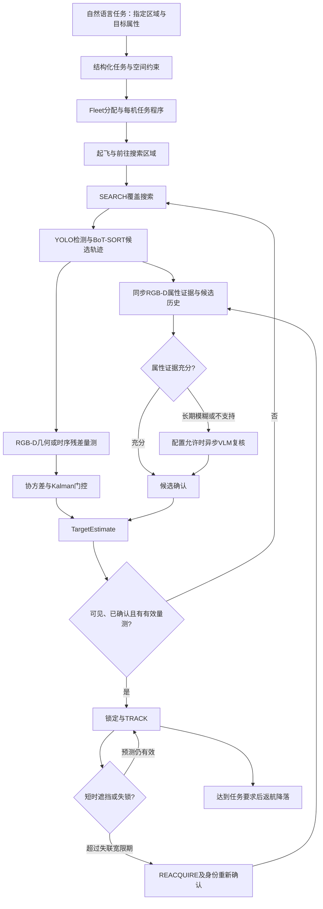

# vlm_drones 中国发明专利选题：现有技术、实现证据与创新方向

检索与代码审查日期：2026-09-08。项目：`/home/amax/ry/vlm_drones`。

**结论：已有高度相似的系统。仍可围绕更具体的技术改进准备发明专利，但不宜把“使用大模型控制无人机到指定地点搜索并锁定目标”作为主要创新。** 优先考虑异步语义证据、候选身份生命周期、当前三维量测和锁定状态之间的联合约束；另一个值得独立发展的方向是遮挡歧义下的时序 RGB-D 量测接受与回退控制。

本报告依据本地源码、配置、已有结果文件及公开论文/专利整理；没有启动新训练或飞行实验，没有改动系统源码。这里的“锁定”指确认指定目标身份并建立持续视觉跟踪状态。文献检索采用通用技术关键词，没有向外部服务上传本地源码。当前尚未取得项目最早对外公开日期或有效申请/优先权日期，因此暂按检索日整理公开文献；不能把以下全部文献不加区分地认定为针对未来或既有申请的法定现有技术。

## 1. 本地系统到底做了什么

系统主要实现位于 `uav_agent/`。从运行入口和核心模块看，技术链路为：

这是功能关系图；并不表示所有可选模块在每一次运行中都启用，也不表示搜索、VLM和控制按图中顺序阻塞执行。

| 层次 | 已查到的实现 | 对专利选题的意义 |
|---|---|---|
| 语言与任务 | 任务解释、目标语义、空间区域、Fleet任务分配、每机技能程序 | 可以作为实施系统背景；自然语言解析和技能调用已有大量先例 |
| 空间与执行 | 区域编译、航线验证、技能前置/后置条件、任务修订与局部程序补丁 | 若围绕具体约束保持和执行连续性形成效果，可作辅助方向 |
| 视觉候选 | YOLO/BoT-SORT、CandidateBank、候选拒绝冷却和重新激活 | 候选ID不是物理身份真值；生命周期隔离有助于处理旧证据 |
| 属性确认 | 同步RGB-D前景颜色、多帧证据积累，困难情形下可调用Qwen复核 | “检测后复核”已有先例，应落到证据时效、关联条件和状态影响 |
| 三维估计 | 确定性RGB-D；可选时序ROI/几何GRU预测像素/深度残差、有效性和方差；后接Kalman | 网络辅助几何和滤波本身已有先例，具体错误抑制机制更值得提炼 |
| 搜索和跟踪 | 首次发现要求可见、已确认、有量测；TRACK允许有界预测；失锁后重捕获 | 状态允许使用哪些证据，是可明确描述并做消融的技术组合 |
| 异步接收 | 视觉审查检查任务、计划、步骤、目标、请求、源帧及年龄 | 已有实际代码基础；仍需处理下述缓存消费边界 |
| 多机 | 每机独立感知状态，共享注册表仲裁已绑定逻辑目标的占用 | 目前不是跨机视觉实体关联，不能声称已经自动识别“两机看到同一物理对象” |

核心代码证据：

- [候选激活与确认](/home/amax/ry/vlm_drones/uav_agent/perception/target_perception_coordinator.py:1435)：候选切换时重置部分历史；确认要求足够轨迹证据和当前有效三维位置；语义证据与对应时刻的轨迹证据对齐。
- [按需语义复核](/home/amax/ry/vlm_drones/uav_agent/perception/target_perception_coordinator.py:1635)：正常RGB-D属性积累尚未完成时，不能由恰好到达的Qwen结果直接绕过。
- [确定性重捕获](/home/amax/ry/vlm_drones/uav_agent/perception/target_perception_coordinator.py:1815)：在相关Qwen门控关闭的配置下，需要颜色证据、最近确认状态、预测时间窗及位置接近条件；不是看到同类目标就重绑定。
- [时序量测与拒绝/回退](/home/amax/ry/vlm_drones/uav_agent/perception/temporal_ray_depth.py:644)、[几何输出约束](/home/amax/ry/vlm_drones/uav_agent/perception/temporal_ray_depth.py:930)、[时序网络](/home/amax/ry/vlm_drones/uav_agent/training/target_state/model.py:27)。
- [RGB-D一致性检查](/home/amax/ry/vlm_drones/uav_agent/perception/rgbd_consistency.py:53)：深度表面竞争、颜色与经位姿转换的表面运动连续性；是保守启发式，并非实例分割或真实身份判定器。

**必须保留的实现边界：** 视觉审查的异步结果接收已经有计划版本校验，但已接受的候选审查缓存，在 `latest_candidate_review` 读取时并未重新检查全部当前任务/计划版本。因此可写“接收时版本校验与候选生命周期隔离”，不能写“所有证据消费路径均已完整验证当前版本”。补齐消费侧检查可以是后续改进，但仅增加版本号本身通常不足以支撑创造性。详见[系统结构与代码证据](系统结构与代码证据.md)。

## 2. 与场景最接近的已公开专利

以下列的是**公开/公告日**，不是申请日。完整著录项目和更多文献见[专利文献对照表](专利文献对照表.md)。专利文献用于技术比对，不等于可直接运行的实验基线。

| 文献 | 公开日 | 与本项目相同或相近之处 | 对选题的影响 |
|---|---|---|---|
| [CN119759083A：一种基于大型语言模型的无人机自主目标搜寻系统及方法](https://patents.google.com/patent/CN119759083A/zh) | 2025-04-04 | 语言任务、飞往指定搜索地点、扫描、检测、定位、再规划 | **总体场景最接近的候选对比文件**；“到地点搜索目标”的大框架已公开 |
| [CN118502456A：一种实现无人机飞行助手的感知与控制方法及系统](https://patents.google.com/patent/CN118502456A/zh) | 2024-08-16 | LLM任务序列、三维点位导航、前视搜索定位、下视再次检测 | “先导航再搜索、二次视觉确认”也已有具体公开 |
| [CN119992387A：高动态环境中执行复杂语言指令的安全飞行智能体系统](https://patents.google.com/patent/CN119992387A/zh) | 2025-05-13 | 高低层感知与规划、任务状态及记忆、搜索/跟随、避障追踪 | 双层大模型架构和搜索跟随不能单独主张原创 |
| [CN120449105A：一种基于思维链的大小模型协同目标检测与识别方法](https://patents.google.com/patent/CN120449105A/zh) | 2025-08-08 | 小模型快速检测，疑难结果交多模态大模型重新识别 | “YOLO初筛+VLM确认”本身较弱；该专利完整权项还涉及训练闭环 |
| [CN118570251A：一种基于语言引导的单目标跟踪方法及系统](https://patents.google.com/patent/CN118570251A/zh) | 2024-08-30 | 语言指定目标，视觉语言特征与轨迹历史融合 | 语言引导跟踪有先例；二维跟踪框与无人机任务完成仍是不同层次 |
| [CN121346811A：一种自适应无人机智能导航方法及系统](https://patents.google.com/patent/CN121346811A/zh) | 2026-01-16 | 困惑度驱动高度调整，改善观察目标的视角 | 单独“看不清就换高度”不足以形成有力区别 |
| [CN121523357A：一种无人机视觉跟踪控制方法及系统](https://patents.google.com/patent/CN121523357A/zh) | 2026-02-13 | 低置信时根据预测和光照可靠性安排重捕获搜索 | 失锁后按置信度重搜已有具体方法 |
| [CN121741750A：一种多速率异步融合光电跟踪与激光雷达约束校正的重捕获装置及方法](https://patents.google.com/patent/CN121741750A/zh) | 2026-03-27 | 异步传感、延迟补偿、跟踪/疑似丢失/重捕获状态机 | “异步融合+重捕获”已有公开；应进一步区分语义证据与数值量测的处理 |

对于第一件专利，适合做的不是把“绕圆搜索”简单替换成栅格搜索，而是明确你解决的额外技术问题：**当语义判断返回时，观察对象可能已换轨、被遮挡或任务已修订，如何避免旧语义结果使错误对象获得锁定状态。** 这是针对本地实现和对比文件作出的选题推断，还不是新颖性/创造性的确定结论。[CN119759083A全文](https://patents.google.com/patent/CN119759083A/zh)

## 3. 论文应分成完整任务对照与模块对照

完整任务对照用于比较“能否找到目标、花多长时间”；模块对照用于检验“为何误锁少、失锁后为何能找回原目标”。不能把别人在不同平台、不同传感器和不同成功标准上的论文数字直接搬来证明本系统优越。

重点先读以下文献；准确首发时间、代码核验及扩展条目见[论文与方法对照表](论文与方法对照表.md)。

| 论文/方法 | 核心共同点 | 适合怎样对比 |
|---|---|---|
| [AirHunt，2026](https://arxiv.org/abs/2601.12742) | 空中目标搜索、异步VLM语义与候选验证、连续规划 | 非常接近整体系统；重点比较验证结果进入锁定/跟踪时的规则。作者仓库在本次核验时仍标示代码待发布 |
| [NEUSIS，2024](https://arxiv.org/abs/2409.10196) | 复杂无人机搜索、神经符号规划、多帧几何及属性信息更新 | 对比目标证据积累与任务执行；官方仓库存在不等于算法源码已开放 |
| [Towards Realistic UAV Vision-Language Navigation: Platform, Benchmark, and Methodology / UAV-Need-Help，2024](https://arxiv.org/abs/2410.07087) | 连续空间无人机物体搜索与分层轨迹生成 | 有公开实现，适合作整体搜索基线；需统一传感器、飞行接口及任务终止条件 |
| [UAV-VLRR，2025](https://arxiv.org/abs/2503.02465) | VLM/LLM语义目标理解与无人机响应控制 | 对比语言到目标和运动控制；持续身份锁定需另行适配 |
| [RTNav，2026](https://arxiv.org/abs/2608.26496) | 检测候选、按需VLM复核、RGB-D定位、多模块异步运行 | 是候选复核调度的强模块对照；地面ObjectNav方法移植到无人机需适配，不能称原生无人机基线 |
| [Uncertainty-Informed Active Perception，2025](https://arxiv.org/abs/2506.13367) | 概率语义地图与不确定性驱动主动搜索 | 比较主动观察/搜索收益；不能再把“不确定性驱动搜索”单独宣称新颖 |
| [OpenBelief-Nav，2026](https://arxiv.org/abs/2608.13923) | 保留观察证据，抵达后结合可见性、语义和几何确认，失败则换候选 | 对“多证据共同确认”和拒绝候选记忆构成直接近邻 |
| [ActFovea，2026](https://arxiv.org/abs/2607.29169) | 观测新鲜度与几何/本体状态/动作一致性运行监控 | 处理机器人操作而非空中搜索，但提示“过期图像安全检查”已有一般技术基础 |
| [Neural RGB→D Sensing，CVPR 2019](https://arxiv.org/abs/1901.02571)；[KalmanNet，2021首发](https://arxiv.org/abs/2107.10043) | 分别涉及时序深度不确定性与网络辅助滤波 | 几何估计方向的基础现有技术；并非本系统可直接替换的完整无人机任务方法 |

还应区分“延迟量测融合”和“延迟语义确认”。前者已有长期研究，例如[2004年OOSM跟踪论文](https://doi.org/10.1109/TAES.2004.1292140)及[2010年选择性融合论文](https://www.sciencedirect.com/science/article/pii/S1566253509000591)。仅给结果加时间戳、丢弃过期值或按不确定度筛选，不能合理视为全新的跟踪思想。

## 4. 优先创新方向A：异步语义证据与身份、量测及锁定状态的联合约束

**建议选题名称：一种基于候选身份与时空证据一致性的无人机目标搜索、锁定及重捕获方法。**

技术问题：多目标交叉、短时遮挡或任务修订时，低频VLM对旧图像的肯定结果可能被用于当前不同候选；同时，滤波器即使在没有新量测时仍可输出预测位置，容易使“认为目标还在”与“当前确认找到了目标”混淆。

已有基础包括：候选生命周期重置；接收侧任务/计划/请求等校验；语义与历史轨迹时刻对齐；初始确认需要当前三维量测；新轨重捕获需要额外身份条件。**适合主张的是这些处理之间为防止误锁形成的具体关系，而不是模块列表。**

可以写入技术交底的流程骨架：

1. 将指令转换为搜索区域与目标属性约束，在无人机抵达区域后建立候选轨迹。
2. 对每个候选建立独立的观察记录，保存采集时间、框、轨迹标识、任务路由、图像引用和几何量测来源；当候选拒绝后重新激活或发生身份断裂时，使相应旧确认依据失效。
3. 由连续视觉观测形成属性与运动证据，在证据长期模糊、属性不支持，或新轨需要历史身份复核时触发相应语义模型复核；将复核关联到具体观察记录。
4. 结果到达后检查任务上下文、候选生命周期和源观察有效性，将语义结果同其采集时刻相容的轨迹证据关联。
5. 只有目标语义、身份连续性和当前有效三维量测共同满足条件时，允许从搜索/候选状态进入锁定；短时预测只维持既有跟踪，不能单独触发首次发现。TRACK是否报告失锁还由最近真实可见时间与失联宽限期决定，不能把估计器预测时限直接等同于技能失锁时限。
6. 失锁后进入重捕获；新轨按配置采用历史参考帧Qwen身份复核，或颜色、预测位置及时间窗的确定性复核，然后才恢复原逻辑目标身份。两条路径并非都执行同一数值位置门控。

这只是选题及流程骨架，尚不是完成的独立权利要求。步骤之间哪些特征必须共同保留，需要针对AirHunt、RTNav、NEUSIS、上述中国专利逐项比较后决定；不能为了写得宽而删掉真正产生效果的约束。

**建议补强、目前未完整实现的内容：**

- 给语义证据建立统一的候选“世代”或身份版本，在接收、缓存取用、状态转移三处应用同一有效性判定；明确哪些计划修订会使目标语义失效，避免任何小修订都清空有用证据。
- 从固定过期时间扩展为与运动和视野有关的有效性范围。例如把历史确认目标的不确定区域外推到当前时刻，投影到当前相机，要求与当前测量框相容且没有竞争候选；即使相容，首次锁定仍需新量测。
- 根据不通过的原因，选择继续覆盖搜索、暂时维持已确认目标的预测跟踪，或执行受约束的补充观察。VLM的文本自信分数本身不能当作校准后的物理误差概率。

上述扩展属于建议，不能在现阶段交底书中写成已有实验结果。运动外推、数据关联和有效性门控分别已有先例；真正需要证明的是特定组合降低了误锁/错认，并且相较简单超时策略没有造成过多延迟和漏确认。

**预期效果与实验：** 在人为控制的VLM延迟、请求乱序、任务改派、tracker ID复用、相似目标交叉条件下，比较误锁率、旧证据错误接受率、原目标重捕获率、确认时延、VLM调用量。若只证明“程序不会报错”，不足以支持这条主线。

## 5. 创新方向B：遮挡歧义下的时序RGB-D量测接受与分级回退

**建议选题名称：一种面向无人机目标跟踪的时序射线深度校正与歧义量测抑制方法。**

技术问题：检测框正确并不保证深度属于目标。框内可能混入地面或遮挡物；学到的深度残差和普通几何回退都可能使用同一个错误表面，最终向控制器提供很确信但错误的位置。

本项目时序网络的实际设计是：同候选最近7个时间位置的RGB-D ROI、检测和几何特征，经过ROI编码、25维几何编码及GRU，输出像素残差、深度残差、量测有效性和三轴对数方差，再按已知相机几何形成三维量测，交给Kalman。不是由VLM直接生成三维坐标。

可重点提炼的组合是：**先检查当前检测所对应的表面是否有可用且不冲突的RGB-D证据，再做时序残差校正；把“暂时没有足够时序信息”和“明确发现表面歧义/模型拒绝”分开，前者才允许合规几何回退，后者不能被回退绕过；将量测拒绝传递到锁定和重捕获状态。** 当前源码已具有这类分支，但新版表面一致性检查是否生效还由模型制品协议决定。[代码](/home/amax/ry/vlm_drones/uav_agent/perception/temporal_ray_depth.py:644)

| 失效类型 | 可描述的处理原则 | 为什么有用 |
|---|---|---|
| 当前RGB-D可靠，但时序历史不足 | 使用经过同一输入约束检查的确定性几何量测，记录来源 | 允许系统启动或换轨后的有限恢复 |
| 多个有支撑的深度表面、中心表面支撑不足 | 不接受该量测，继续采集或补充观察 | 避免以“最近/最大深度簇”武断指认目标 |
| 网络明确判量测无效或校正后像素/深度越界 | 不能用旧baseline把明确拒绝变为通过 | 防止兜底路径取消前面的拒绝决定 |
| 当前没有量测，已有锁定目标仍处于短预测窗内 | 输出带预测来源的估计，首次锁定权限保持关闭 | 把运动连续性与当前测量证据分开 |

**状态边界：** 新版 `rgbd_consistency_v1` 是有代码和局部检查的保守规则；旧生产模型默认不启用该新协议。当前未发现新版geometry V2训练目录中的最终 `model_manifest.json`。不能把旧模型的五次闭环成功，移用为新版一致性规则已经闭环验证的证据。稳定占据ROI的干扰物仍可能绕过当前启发式，需要继续改善。[版本说明](/home/amax/ry/vlm_drones/uav_agent/docs/target_state_geometry_v2.md)

该方向需要进一步检索目标级RGB-D跟踪、遮挡分割、深度补全、选择性预测和拒绝机制。Neural RGB→D、KalmanNet及传统几何关联构成基础；“CNN/GRU+Kalman”本身不能作为主要区别。

建议对比：确定性前景深度+Kalman；仅时序残差；时序残差+有效性头；增加表面歧义检查；再增加分级回退。必须同时报告接受率、错误量测接受率、所有可见目标的失败率和位置误差，不能通过拒绝大量困难帧只报告接受帧误差变小。

## 6. 进一步研发方向C：按歧义原因选择验证视点

**这是后续研发建议，当前仓库不能视为已完整实现。** 已有INSPECT、搜索策略及next-best-view相关接口可作为基础，但“有视点接口”不等于已经实现信息增益或属性可观测性优化。

把未确认原因区分为：目标太小、颜色样本不足、存在遮挡表面、两个候选身份接近、空间关系看不全。让视点规划选择能够减少对应歧义的动作，例如近移提高像素覆盖、侧移分离遮挡表面、绕行观察附属特征，并受搜索边界、障碍、时间和飞行距离约束。

可设计候选动作的效用为：预计语义歧义减少量与预计几何不确定性减少量的加权和，减去飞行时间、风险及推理开销；选择动作后使用真实新观测更新证据。这个效用式只是设计框架，必须补足各项如何计算和标定，不能仅在专利中写“选择最优视点”。

主动感知和不确定性搜索已有[相关论文](https://arxiv.org/abs/2506.13367)，无人机调高低改善观察也见[CN121346811A](https://patents.google.com/patent/CN121346811A/zh)。较值得研究的差异是：同一个身份/语义/几何证据状态既决定能否锁定，也决定下一次采集哪类证据，并且避免因换视点把不同目标的证据拼接起来。

## 7. 其他点如何取舍

| 点子 | 建议 |
|---|---|
| 受空间和目标约束的局部任务补丁 | 有代码基础，可保留已完成步骤并修订局部计划；图后缀patch存在，但graph+障碍/gate组合当前受CLI禁用，不能称完整闭环已部署。应突出约束保持和执行效果，JSON校验本身偏常规工程 |
| 多机自动发现同一个物理目标并交接 | 目前未实现跨机实体关联；若开展研发，需增加跨机时空/外观关联、占用失效和身份交接机制，不能用现有逻辑ID锁直接替代 |
| 普通YOLO换成YOLOE、Qwen换成另一VLM | 模型替换不足以证明创造性；主方案应使用功能性模块描述，品牌和版本作为实施例 |
| Oracle与生产感知隔离、模型hash、审计日志 | 对实验可信度和工程可靠性有价值，适合作实施保障；目前不建议当本场景的专利主创新 |
| RGB-D属性识别、多帧投票、Kalman预测、SEARCH/TRACK状态机 | 多为已有构件。只有在特定联合规则和可证明效果中，才可能构成有意义的区别组合 |

## 8. 可以实际开展的对比实验

**建议优先做一组受控闭环基线和一组强近邻复现/改造。** 前者能定位本项目贡献，后者避免只与过弱方法比较。下列是实验设计，不是已运行结果。

| 编号 | 基线/消融 | 用途 |
|---|---|---|
| B0 | 固定区域覆盖搜索+同一YOLO/BoT-SORT+确定性RGB-D+Kalman+常规确认 | 给出不用VLM的合理基线，不应故意只单帧确认来削弱它 |
| B1 | 与B0相同，增加串行按需VLM复核 | 测量语义复核收益及等待成本 |
| B2 | 异步按需复核，只保留基本时间超时 | 检验任务/候选生命周期校验相对简单时效处理的贡献 |
| B3 | 本项目现有完整流程 | 如实保留当前缓存消费和配置边界 |
| B4 | B3分别去掉候选生命周期隔离、语义轨迹时刻对齐、新轨重新确认、首次锁定量测条件 | 每次只改一个因素，定位误锁/重捕获的原因；仅在仿真中注入这些故障 |
| B5 | 补强后的统一证据有效性及动作权限方案 | 和B3比较，不能把B5提前写成当前系统结果 |
| B6 | UAV-Need-Help完整搜索实现，或AirHunt式方法的明确标注重实现 | 整体任务对比；确认代码可用性，不能把自写近似版本称作者原版 |
| B7 | RTNav候选验证模块改造 | 比较真实时间异步检测/复核调度；注明地面到空中和传感器适配 |
| B8 | 语言引导跟踪器/UNIFollow等，配相同的搜索和控制壳 | 对比跟踪身份保持；原论文若只输出框，须说明闭环适配 |

用同一场景实例、目标运动、语言任务、相机及深度、检测权重、低层控制器、最大飞行时间和推理硬件；对不兼容方法另列传感器条件。比较系统设计时尽量控制主干模型一致；比较原方法时保留原配置并披露差异。

至少覆盖：同类同色与异色干扰、交叉换轨、短/长遮挡、出视野、目标不在区域、无目标误检、RGB-D噪声/丢帧、VLM延迟及乱序、任务变更。建议按不同场景族划分训练/验证/最终测试，并在每个关键条件使用足够的独立任务重复，例如30次起步、再按置信区间确定是否增加；数量是工程建议，不是专利法定门槛。

建议指标定义：

- **错误锁定率**：错误物理目标获得锁定的任务数/全部任务数；同时报告错误锁定事件数/全部锁定事件数，避免两种分母混用。
- **正确首次锁定时间**：从到达搜索区域到第一次正确锁定；失败任务单独计入成功率，并以时间到事件或统一截断规则处理，不能只用成功任务均值掩盖失败。
- **跟踪与重捕获**：确认后原目标有效跟踪比例、错误身份切换、失锁次数、原目标重捕获率和耗时；重捕获率分母为符合测试协议的失锁事件。
- **语义结果时效**：不相容旧结果被接受的次数、拒绝有效旧结果的比例、队列/推理延迟、VLM请求次数和GPU用时。
- **几何量测**：中位数/P95/必要时P99误差、可见样本失败率、无目标错误量测率、模型与baseline共同接受子集的误差，以及全体样本接受比例。
- **整体任务**：成功率、到达/搜索/跟踪/返航各阶段结果、航程、时间和碰撞；没有能耗模型时不要把航程自动称为电量节省。

只由评估器使用物理真值判定身份和误差。生产算法仍只读真实可部署传感输入。本次没有新跑上述实验。

## 9. 现有实验究竟能支持哪些表述

已读取本地[旧生产Stage B v2模型清单](/home/amax/ry/vlm_drones/outputs/trained_models/target_state/temporal_ray_depth_yolo_deployment_v2/model_manifest.json)，而非仅转述README：

| 指标 | 时序模型 | 确定性RGB-D baseline | 解释 |
|---|---:|---:|---|
| 验证集位置误差中位数 | 0.2519 m | 0.5819 m | 旧评估协议下模型更低 |
| 测试集位置误差中位数 | 0.2700 m | 0.5877 m | 约降低54%，仅限该数据与统计定义 |
| 测试集位置误差P95 | 26.7858 m | 26.9886 m | 严重长尾仍在，不能描述成普遍亚米级 |
| 测试集遮挡样本位置误差中位数 | 26.4983 m | 26.7135 m | 遮挡条件仍很弱，恰好说明歧义量测方向有研发价值 |
| 测试集量测失败率 | 0.3444 | 0.3500 | 不能只看被接受/可评估位置的中位数 |

[五个固定seed闭环汇总](/home/amax/ry/vlm_drones/uav_agent/logs/yolo_fixed_seed_eval/task9_temporal_5seeds/summary.json)记载5/5 `strict_success=true`，每次完成20秒跟踪，记录的 `target_lost_count` 均为0。因此它支持“这些仿真任务跑通”，**并未证明失锁重捕获已经经过困难场景验证**，更不是实机飞行证据。进一步核对这五次各自运行汇总，Qwen视觉均为disabled、`reacquire_attempts=0`；该批次也不能证明异步VLM证据门控有效。

单机已有smoke的汇总还记录Qwen视觉关闭、`reacquire_attempts=0`、`position_rmse=null`。因此这份smoke不能证明VLM复核的收益、重捕获有效性或定位RMSE；它证明的是相应配置的有限仿真闭环。[smoke汇总](/home/amax/ry/vlm_drones/uav_agent/logs/fleet_missions/runs/fleet_mission/20260825-194528_fleet_mission_seed0_nogit/summary.json)

另外，50k Stage B模型清单中的 `promotion.passed=false`；保存输出的gate V2复查文件标明 `full_v2_evaluation=false`，没有重放完整运行时/Kalman。新版geometry V2局部检查通过只证明指定检查通过，不能与旧模型/旧协议结果混写。[50k清单](/home/amax/ry/vlm_drones/outputs/trained_models/target_state_extreme_50k/temporal_ray_depth_yolo_deployment_50k_v1/model_manifest.json)、[复查文件](/home/amax/ry/vlm_drones/outputs/diagnostics/audit_stageb_50k_v1/review_gate_v2/review.json)

以上均为已有文件的读取结论，本次未重新复现实验，也未重新校准模型。

## 10. 中国专利交底如何组织

从当前内容看，适合围绕具体方法及对应系统准备**发明专利**。不要直接把整个代码目录转换成权利要求；先选一个主要技术问题，把输入、处理条件、输出以及对无人机动作的影响说明白。

《专利法》第22条要求新颖性、创造性和实用性，第26条要求充分公开并支持权利要求。2026年1月1日起施行的相关审查指南修改强调，AI方案需说明模型必要结构/训练内容，或模型如何与具体技术场景和输入输出相结合。仅把既有算法换一个应用对象，未体现适应性技术改进，并不自动具备创造性。[专利法](https://www.cnipa.gov.cn/art/2020/11/23/art_97_155167.html)、[国家知识产权局第84号令](https://www.cnipa.gov.cn/art/2025/11/14/art_99_202568.html)

可准备的交底材料包括：系统关系图、候选生命周期图、异步请求与结果接收时序图、量测接受/拒绝/回退分支图、状态转移条件、一个具体失败案例及修复后的过程、受控对比实验。若涉及网络，列明输入特征语义、网络连接、输出含义、损失、训练/评估划分及必要参数；不需要把所有工程配置都塞进独立权利要求。

建议首先推进方向A；方向B可作为独立研发/独立申请候选，或作为A的可选实施方式，是否满足同一申请的单一性需要按最终共同技术构思判断。方向C暂列研发扩展。报告中的“优先”表示技术交底准备价值，不表示授权概率。

尚需补足两项决定性信息：项目第一次公开的日期与具体范围；是否已有有效申请或优先权日。申请日前公开的论文、专利和你自己公开的资料都可能影响评估。对于后公开但先申请的同样发明，还需单独核对抵触申请条件，不能只按网页公开日筛选。有限检索不能保证没有相同方案；正式申请前应由专利代理师复核独立权利要求、专利族、原始文本及相关审查档案，本报告不作授权或自由实施结论。[专利法第22、24、26条](https://www.cnipa.gov.cn/art/2020/11/23/art_97_155167.html)

## 11. 检索范围与后续检索入口

论文来源采用arXiv、论文项目页、会议/期刊原文及作者仓库；专利使用Google Patents公开全文和著录项目，法律/审查要求使用CNIPA。没有完成CNIPA检索系统中的全面分类检索、付费数据库检索或法律状态核查。

代表性中文检索式：无人机 大语言模型 指定地点 目标搜寻；无人机 视觉语言 搜索 跟踪；大小模型 目标检测 复核；无人机 目标重捕获；异步 多传感器 时间戳 跟踪；无人机 语义不确定 主动视点。

代表性英文检索式：UAV language-guided object search; aerial object navigation VLM asynchronous verification; language-guided target following; object confirmation active perception; RGB-D temporal depth uncertainty tracking; out-of-sequence measurements target tracking。

后续适合按概念分别追查：语义证据过期、轨迹身份复用、候选记忆失效、目标确认与预测状态分离、物体表面歧义拒绝、拒绝条件下fallback控制、属性可观测性与验证视点。上述词组比仅检索“VLM无人机”更接近拟保护的技术特征。
