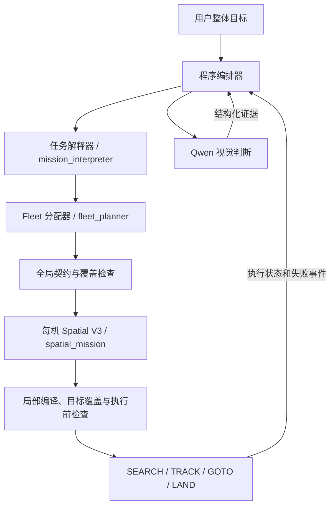

# 独立规划模块与可调用工具

全局规划现由 [`FleetPlanningService`](../fleet/planning_service.py) 提供，
与视觉判断、单机技能执行分开。它使用程序提供的配置与模型工厂，
按角色选择 Qwen 基模或已登记的 LoRA。



全局服务负责图中的任务解释、Fleet 分配和全局检查。
[`run_fleet_mission.py`](../scripts/run_fleet_mission.py) 负责后续单机规划、编译及运行时发布。
新建 LLM 任务必经 `service.plan()`；运行中重分配调用
`service.plan_request(..., replan=True)`，复用程序构造的版本化可信状态，
无需再次解释用户原文。现有修复次数、单机失败隔离、降级状态、执行前检查及原子发布规则继续生效。

对话模型可以通过 [`FleetPlanningTool`](../fleet/planning_tool.py) 请求全局规划。
该工具不属于 `skills/` 中的飞行执行状态机，不调用其他执行技能，不发布飞行任务。
现有任务主流程由程序直接调用服务；无需增加一次“让通用模型决定要不要规划”的推理。

## Python 服务接口

```python
from configs.loader import load_config
from common.ids import generate_routing_id
from fleet.planning_service import FleetPlanningService
from models.adapter_registry import AdapterRegistry
from models.model_client_factory import ModelClientFactory

config = load_config("configs/benchmarks/fleet_scaling/open_10x10.yaml")
clients = ModelClientFactory(
    AdapterRegistry("configs/adapters.json"),
    base_url="http://127.0.0.1:8000/v1",
)
service = FleetPlanningService(
    config, clients,
    interpreter_max_tokens=8192,
    fleet_max_tokens=4096,
)
audit = {}
result = service.plan(
    "你的完整多机任务指令",
    fleet_mission_id=generate_routing_id("fleet_mission"),
    audit_context=audit,
)
print(result.to_dict())
```

服务只向解释器暴露可信别名，向 Fleet 暴露生产 request builder 构造的投影，
不会将整个仿真配置或目标真实坐标直接塞进提示。
服务返回 typed `task_spec`、`request`、`plan`、语义检查结果、提案与诊断。
失败同样记录本轮已产生的诊断，然后抛出原异常。

`plan_request()` 接受宿主构造的 `FleetMissionRequestV2`，并可接收
`assignment_id` / `uav_id` 作为日志路由。模型无权指定这些接口级路由值。

## 工具接口

```python
from fleet.planning_tool import FleetPlanningTool

tool = FleetPlanningTool(service)
tool_schema = tool.tool_definition()  # 交给对话宿主的 tools 列表
proposal = tool.invoke({"instruction": "你的完整原始任务"})

# 宿主收到模型的 function tool_call 后，可转交给：
# reply = tool.handle_tool_call(tool_call, audit_context={})
# reply 是带 tool_call_id 的 role=tool 消息。
```

模型可见参数只有 `instruction`。场景配置、适配器、服务地址、预算和可信状态在创建服务时绑定；
工具调用不能覆盖这些字段。每次新工具调用由程序生成独立 mission ID。
`handle_tool_call()` 处理的是宿主已经收到的工具调用；本次没有新增一个自动运行的对话循环。

返回状态：

| 状态 | 含义 |
| --- | --- |
| `proposal_ready` | 相对于本次解释出的 TaskSpec，全部目标已分配，现有语义检查无发现且没有解释歧义 |
| `incomplete_assignment` | 存在未覆盖目标、语义检查发现或解释歧义，需要宿主继续处理 |
| `planning_failed` | 解释或分配无法生成通过生产契约检查的输出 |
| `invalid_arguments` | 工具调用参数错误；在模型推理前拒绝，作为工具消息返回 |

直接 `invoke()` 遇到参数错误会抛出 `PlanningToolInputError`；
`handle_tool_call()` 将其转为可反馈给对话模型的 `invalid_arguments`。
规划失败返回错误类型与阶段，原始提案留在宿主审计中。

`proposal_ready` **不代表完整任务已经可执行**。所有工具结果均明确
`execution_started=false`、`executable=false`、`local_compilation_performed=false`。
覆盖检查的范围是 `interpreted_task_spec_assignment`；解释器本身是否忠实保留了原始任务，
以及单机计划能否完成全部目标，还需后续独立检查。
这避免将程序补全或上游遗漏掩盖成模型自主成功。

## 仅生成全局计划的 CLI

从 `uav_agent` 目录执行：

```bash
./python.sh scripts/plan_fleet.py --tool-schema

./python.sh scripts/plan_fleet.py \
  --config configs/benchmarks/fleet_scaling/open_10x10.yaml \
  --validate-only

./python.sh scripts/plan_fleet.py \
  --config configs/multi_uav_open_4x4.yaml \
  --instruction-file resources/fleet_open_4x4/mission.txt \
  --base-url http://127.0.0.1:8000/v1 \
  --interpreter-max-tokens 8192 --fleet-max-tokens 4096 \
  --output ../outputs/planning_service/first_proposal.json
```

前两条命令不调用模型；第三条需要已启动且上下文容纳输入加输出的模型服务。
输出包含工具结果、阶段审计、实际适配器选择及模型调用记录。输出文件必须不存在，
防止覆盖先前实验；省略 `--output` 会写到标准输出。
退出码：0 为配置校验完成或分配提案 ready，2 为不完整/规划失败，1 为参数或配置错误。
CLI 不导入 Isaac、不启动仿真、不执行飞行。

## LoRA 选择

运行路由仍以 [`configs/adapters.json`](../configs/adapters.json) 为准。
`mission_interpreter`、`fleet_planner`、`spatial_mission` 是独立适配器角色，
可以共享同一 Qwen 基座服务。当前仍为 placeholder，实际调用会明确记录回退到基模。
本次实现结构与接口，没有训练或启用新 LoRA。

建议采用语言 Transformer 上的标准 PEFT LoRA，attention 与 MLP 投影均参与，
初始 `r=16 / alpha=32 / dropout=0.05`。详细网络、数据与评测方案见
[`planning_lora_design.md`](planning_lora_design.md)。

## 本次验证（2026-09-12）

`python -m pytest tests/fleet -q`：507 项通过，包含服务、工具、CLI、
既有任务入口、部分机体失败隔离和运行中重分配回归。
CLI 的十机配置 `--validate-only` 及 `--tool-schema` 均通过，零模型调用。

另将上一轮真实 Qwen 的五档响应送入新服务和工具进行离线回放，只调整 Fleet 响应中的
mission ID / plan version 以匹配宿主新建的请求，未修改语义内容：

- 2、8 机正确返回 `incomplete_assignment`，列出全部未分配的返航降落目标。
- 4、6 机返回全局分配 `proposal_ready`，仍明确 `executable=false`，不掩盖旧实验中的局部失败。
- 10 机返回 `planning_failed`，阶段为 `mission_interpretation`，未触发 Fleet 调用。

[离线回放记录](../../outputs/planning_service/response_replay_20260912T121324Z.json)
没有发起新模型推理，也没有运行飞行仿真；它验证的是接口重构与失败分类。
